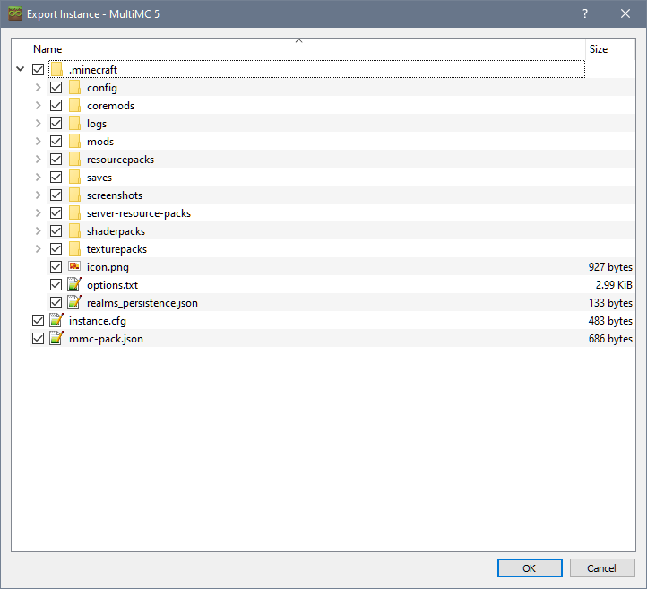

The last section of the _Instance Actions_ menu allows for users to export their instances.

## Exporting an Instance
* select the instance you wish to export but do not launch it.
* Click _Export Instance_. This will bring up a new window asking which files to include in the export.

Exported instances will be saved in a Zip file. You can then share those for other MultiMC users, which can then [import them](Import-Instance) for their own use.

## Exporting

To export an instance select the instance in the main window and then click _Export Instance_ either in the right toolbar or in the context menu.

By default, all the instance files are checked however not all of these are required to create a valid modpack. The following will explain the basics of each common file and folder:

* `/.minecraft`: The main game folder, this includes mods, configs, resource packs and more. This is the main folder you will need in any other launcher.
* `/instance.cfg`: MultiMC specific information about the instance, like name, playtime and selected icon
* `/mmc-pack.json`: MultiMC specific information about which libraries and versions this instance needs.
* `/patches`: Older mod-loaders are stored here such as Forge and Liteloader. Most other launchers have their own way of doing this so would only be necessary for importing back into MultiMC.
* `/libraries`: Older mod-loaders are stored here such as Forge and Liteloader. Most other launchers have their own way of doing this so would only be necessary for importing back into MultiMC.
* `/jarmods`: Jar-Mods that would normally go into the minecraft.jar are stored here. Most other launchers would require you to add these manually. Should only be used for importing back into MultiMC.
